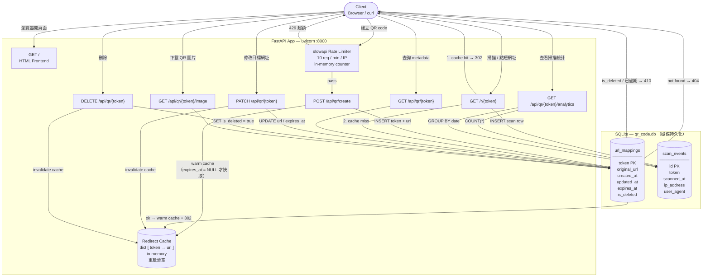

# QR Code Generator — 資料拓樸圖

## Q1｜這個服務有開 DB 嗎？

**有，是真實的 SQLite 檔案**，路徑在 `scaffold/qr_code.db`。  
服務啟動時 `Base.metadata.create_all()` 會自動建立資料表，所有 token 與原始 URL 都**持久化到磁碟**，重啟不會消失。  
`redirect_cache` 是一個 Python `dict`，只是熱路徑的加速層（in-memory），服務重啟後會清空。

## Q2｜掃描次數的計數器在哪？

計數器**沒有獨立欄位**，而是用 `scan_events` 資料表的 row 數量做聚合：

- 每次 `GET /r/{token}` 成功 redirect，`_record_scan()` 就往 `scan_events` 插一筆 row（含 timestamp、IP、user-agent）
- `GET /api/qr/{token}/analytics` 用 `SELECT COUNT(*) ... GROUP BY date(scanned_at)` 即時算出每日掃描數

這種設計的好處是可以隨時做時間區間查詢，壞處是資料量大後 COUNT 會變慢（需要加 index，目前已有 `idx_token_scanned`）。

---

## Q3｜資料拓樸圖

---

## 資料存放位置一覽

| 資料 | 存放位置 | 重啟後 |
|------|---------|--------|
| token ↔ 原始 URL | `url_mappings`（SQLite） | **保留** |
| 過期時間、刪除狀態 | `url_mappings`（SQLite） | **保留** |
| 每次掃描紀錄 | `scan_events`（SQLite） | **保留** |
| redirect 快取 | `redirect_cache` dict（記憶體） | **消失** |
| Rate limit 計數 | slowapi 記憶體 counter | **消失** |
